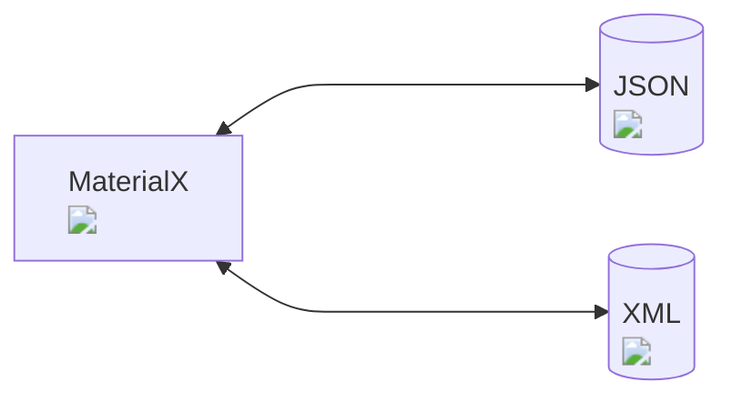

# MaterialXJSON

This is the home page for the `materialxjson` Python package which provides support to conversion to / from JSON of MaterialX documents.

This package provides a JSON data representation that can fully represent a MaterialX document. The JSON representation is targeted at integrations which prefer to use JSON as a data exchange format instead of XML.

## Package

The package can be downloaded from **[PyPi](https://pypi.org/project/materialxjson)**

## Documentation

* **Python Package**: Details about how to use this package can be found **[here](https://kwokcb.github.io/materialxjson/README.html)**.
* **API Documentation**): Python interface documentation can be found **[here](https://kwokcb.github.io/materialxjson/docs/html/index.html)**.

## Integrations

Below is a snapshot from the QuiltiX plugin which uses this package:

. 

Shown is the JSON text preview dialog which allows the user to view the JSON representation of the MaterialX document.

The plugin code is available as a sample which ships with QuiltiX [here](https://github.com/PrismPipeline/QuiltiX/blob/main/sample_plugins/materialxjson/plugin.py)

## Examples

A Jupyter notebook with examples can be found **[here](https://kwokcb.github.io/materialxjson/docs/examples.html)**.

The follow are the JSON representations for examples included with the package:

* glTF "Shoe" Sample Model :
    

JSON Graph

        
    

* MaterialX "Standard Surface" material:
    

JSON Graph

        
    

